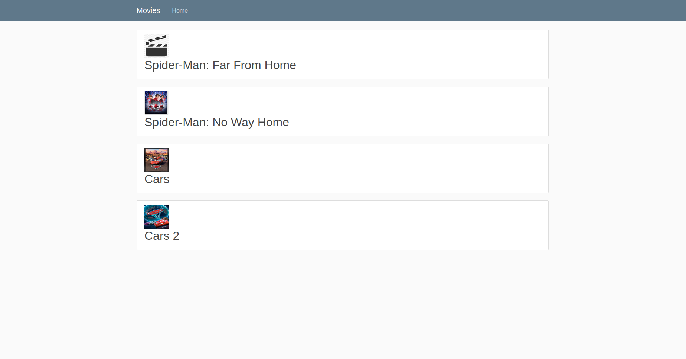

# Movie Database Management
This is a Django project that allows an admin to add movies to the website.

The admin can enter details such as the title, director, genre, and the description. He or she can optionally add a poster image as well(a default image of a clapperboard is used if no poster is provided.). Once a movie has been added, users can see the movies on the main page.

# Admin Adding a Movie

# Main Page

# Detail Page
If one clicks on any of the movies, more details about that movie are shown. 

